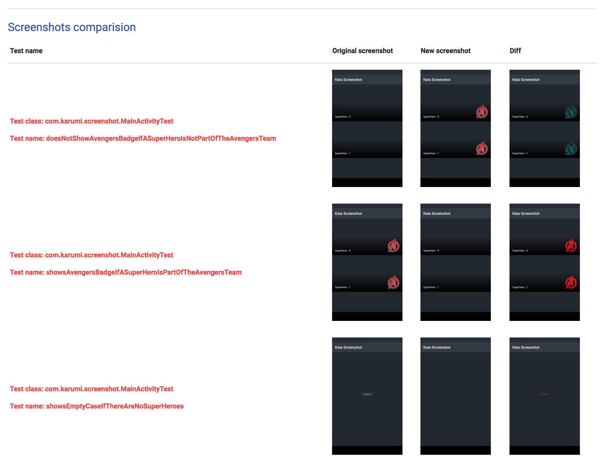
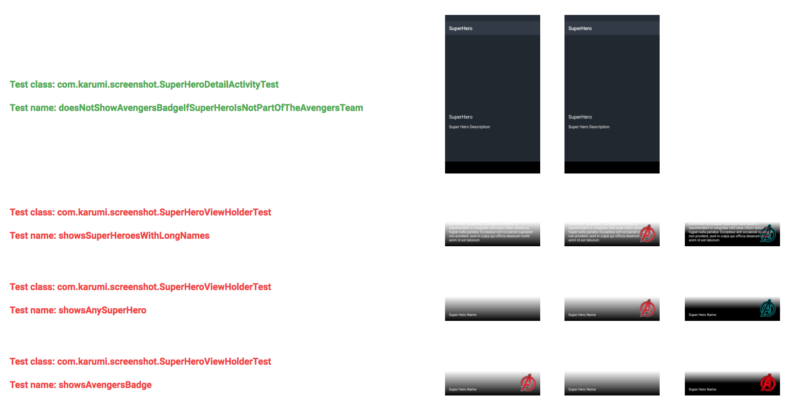

# ![Karumi logo][karumilogo]Shot [](https://app.bitrise.io/app/c7c358c5be663f7c)

Shot is an Android project you can use to write screenshot for your apps in a simple and friendly way.

## What is this?

``Shot`` is a Gradle plugin and a core android library thought to run screenshot tests for Android using the [screenshot testing Facebook SDK](http://facebook.github.io/screenshot-tests-for-android/) under the hood. This project provides a handy interface named ``ScreenshotTest`` and a ready to use ``ShotTestRunner`` you can use in order to simplify your tests design.

**Since Shot 0.3.0 a simple but powerful HTML report is generated after every verification or screenshots recording execution. Here you have an example of the [recording](./art/recordReport.png) and [verification](./art/verificationReport.png) report generated.**
**Since Shot 4.0.0 a custom test runner and a handy interface have been added to the project in order to simplify how screenshots are recorded and verified.**




Record your screenshots executing ``./gradlew executeScreenshotTests -Precord``


And verify your tests executing ``./gradlew executeScreenshotTests``


If Shot finds any error in your tests execution the Gradle plugin will show a report as follows:


You can find the complete Facebook SDK documentation [here](https://facebook.github.io/screenshot-tests-for-android/).

## Getting started

Setup the Gradle plugin:

```groovy
  buildscript {
    // ...
    dependencies {
      // ...
      classpath 'com.karumi:shot:4.0.0'
    }
  }
  apply plugin: 'shot'
```

This plugin sets up a few convenience commands you can list executing ``./gradlew tasks`` and reviewing the ``Shot`` associated tasks:


**If you are using flavors the available Shot gradle tasks will be configured based on your flavors and build types configuration.** You can find all the available shot tasks by executing ``./gradlew tasks``. For example, if your app has two flavors: ``green`` and ``blue`` the list of available Shot tasks will be:

```groovy
executeScreenshotTests - Checks the user interface screenshot tests. If you execute this task using -Precord param the screenshot will be regenerated.
blueDebugDownloadScreenshots - Retrieves the screenshots stored into the Android device where the tests were executed for the build BlueDebug
blueDebugExecuteScreenshotTests - Records the user interface tests screenshots. If you execute this task using -Precord param the screenshot will be regenerated for the build BlueDebug
blueDebugRemoveScreenshots - Removes the screenshots recorded during the tests execution from the Android device where the tests were executed for the build BlueDebug
greenDebugDownloadScreenshots - Retrieves the screenshots stored into the Android device where the tests were executed for the build GreenDebug
greenDebugExecuteScreenshotTests - Records the user interface tests screenshots. If you execute this task using -Precord param the screenshot will be regenerated for the build GreenDebug
greenDebugRemoveScreenshots - Removes the screenshots recorded during the tests execution from the Android device where the tests were executed for the build GreenDebug
```

If for some reason you are running your tests on a different machine and you want to skip the instrumentation tests execution and just compare the sources remember you can use the following shot configuration:

```groovy
  shot {
    runInstrumentation = false
  }
```

Keep in mind the screenshots library needs the ``WRITE_EXTERNAL_STORAGE`` permission. When testing a library, add this permission to the manifest of the instrumentation apk. If you are testing an application, add this permission to the app under test. To grant this permission you can create an ``AndroidManifest.xml`` file inside the ``androidTest`` folder. Here is an example:

```xml
<?xml version="1.0" encoding="utf-8"?>
<manifest xmlns:android="http://schemas.android.com/apk/res/android"
    package="<YOUR_APP_ID>.test"
    android:sharedUserId="<YOUR_APP_ID>.uid">

    <uses-permission android:name="android.permission.WRITE_EXTERNAL_STORAGE" />

</manifest>
```

**You'll have to add the same ``android:sharedUserId="<YOUR_APP_ID>.uid"`` configuration to your ``app/AndroidManfiest.xml`` file in order to let the testing APK write into the SDCard.**. If you don't do this, you can end up facing a weird error with this message while running your tests:

```
java.lang.RuntimeException: Failed to create the directory /sdcard/screenshots/com.example.snapshottesting.test/screenshots-default for screenshots. Is your sdcard directory read-only?
```

Remember to configure the instrumentation test runner in your ``build.gradle`` as follows:

```groovy
android {
    // ...
    defaultConfig {
        // ...
        testInstrumentationRunner "com.karumi.shot.ShotTestRunner"
    }
    // ...
```

We created this test runner for you extending from the Android one.

Now you are ready to use the ``ScreenshotTest`` interface from your tests:

```kotlin
class MyActivityTest: ScreenshotTest {
    @Test
    fun void theActivityIsShownProperly() {
            val mainActivity = startMainActivity();
           /*
             * Take the actual screenshot. At the end of this call, the screenshot
             * is stored on the device and the gradle plugin takes care of
             * pulling it and displaying it to you in nice ways.
             */
            compareScreenshot(activity);
    }
}
```

***This interface is full of useful methods you can use to take your screenshots with your activities, dialogs fragments, view holders or even custom views***

You can find a complete example in this repository under the folder named ``shot-consumer`` or review [this kata](https://github.com/Karumi/KataScreenshotAndroid/).***

Now you are ready to record and verify your screenshot tests! 

## Recording tests

You can record your screenshot tests executing this command:

```shell
./gradlew <Flavor><BuildType>ExecuteScreenshotTests -Precord
```

or

```shell
./gradlew executeScreenshotTests -Precord
```

This will execute all your integration tests and it will pull all the generated screenshots into your repository so you can easily add them to the version control system.

## Executing tests

Once you have a bunch of screenshot tests recorded you can easily verify if the behaviour of your app is the correct one executing this command:

```shell
./gradlew <Flavor><BuildType>ExecuteScreenshotTests
```

or

```shell
./gradlew executeScreenshotTests
```

**After executing your screenshot tests using the Gradle task ``<Flavor><BuildType>ExecuteScreenshotTests`` a report with all your screenshots will be generated.**

[karumilogo]: https://cloud.githubusercontent.com/assets/858090/11626547/e5a1dc66-9ce3-11e5-908d-537e07e82090.png

## Executing tests in multiple devices

If after some time writing screenshot tests your build takes too long to run our recommendation is to run your tests in multiple devices. **Sharding your tests execution will split your test suite into different devices so your tests execution time will be reduced. This feature is not designed to test the UI across different platforms or screen resolutions, to do that we'd recommend you to configure the size of the screenshot taken by modifing the view height and width.** To run your tests in multiple devices you can use [Composer](https://github.com/gojuno/composer) and the official [Gradle Plugin they provide](https://github.com/trevjonez/composer-gradle-plugin). Composer will take all your tests and will split the test suite execution between all the connected devices. **Remember, if you are going to use more than one device all the devices should use the same Android OS and the same screen resolution and density!** Keep also in mind composer needs Gradle 5.4.1 to be able to run your tests using multiple devices.

Once you've configured composer to run your tests you only need to update Shot to use the composer task as the instrumentation test task as follows:

```groovy
shot {
  useComposer = true
}
```

Take into account the ``instrumentationTestTask`` could be different if you use different flavors or build types. Remember also you should use Shot > 3.0.0 because this feature was introduced in this release!
 
## CI Reporting

Shot generates an HTML report you can review at the end of the recording or verification build. However, if you are running Shot in a CI environment which does not support saving the reporting files generated by the build you can verify your tests using this command ``./gradlew debugExecuteScreenshotTests -PprintBase64``. This will change how Shot show comparision errors displaying a command you can copy and paste on your local terminal for every screenshot test failed.

## Running only some tests

You can run a single test or test class, just add the `android.testInstrumentationRunnerArguments.class` parameter within your gradle call. This option works for both modes, verification and recording, just remember to add the `-Precord` if you want to do the latter.

**Running all tests in a class:**

```shell
./gradlew <Flavor><BuildType>executeScreenshotTests -Pandroid.testInstrumentationRunnerArguments.class=com.your.package.YourClassTest
```

**Running a single test:**

```shell
./gradlew <Flavor><BuildType>executeScreenshotTests -Pandroid.testInstrumentationRunnerArguments.class=com.your.package.YourClassTest#yourTest
```

## iOS support

If you want to apply the same testing technique on iOS you can use [Swift Snapshot Testing](https://github.com/pointfreeco/swift-snapshot-testing)

License
-------

    Copyright 2018 Karumi

    Licensed under the Apache License, Version 2.0 (the "License");
    you may not use this file except in compliance with the License.
    You may obtain a copy of the License at

       http://www.apache.org/licenses/LICENSE-2.0

    Unless required by applicable law or agreed to in writing, software
    distributed under the License is distributed on an "AS IS" BASIS,
    WITHOUT WARRANTIES OR CONDITIONS OF ANY KIND, either express or implied.
    See the License for the specific language governing permissions and
    limitations under the License.
